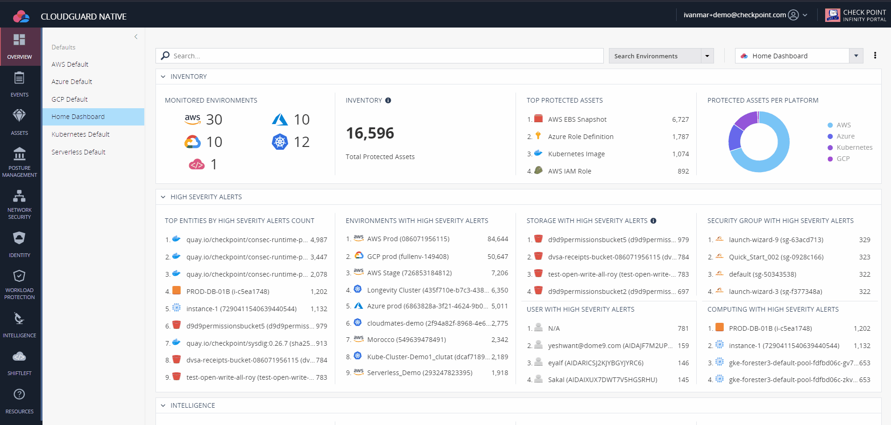
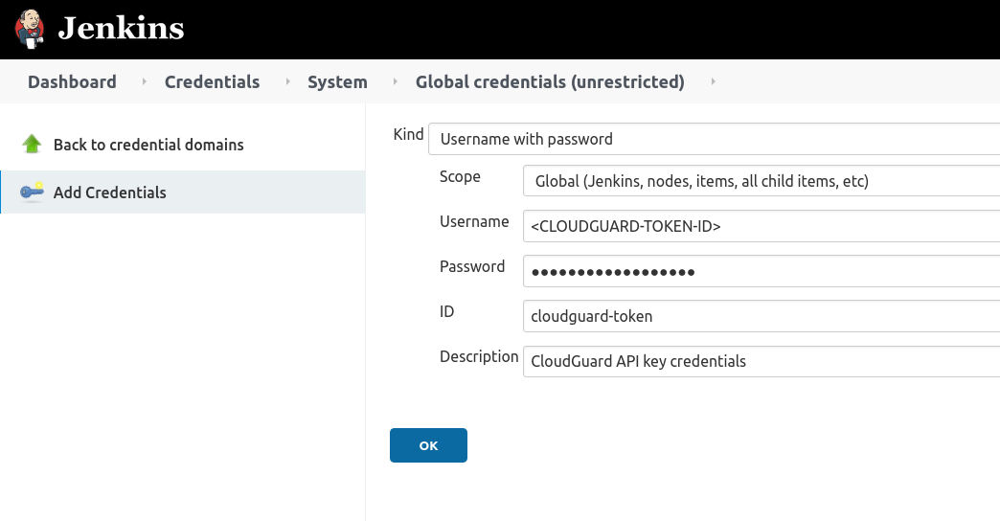
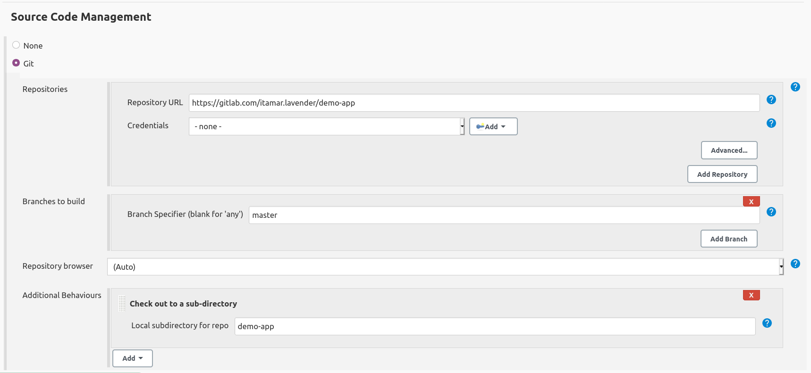
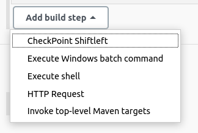
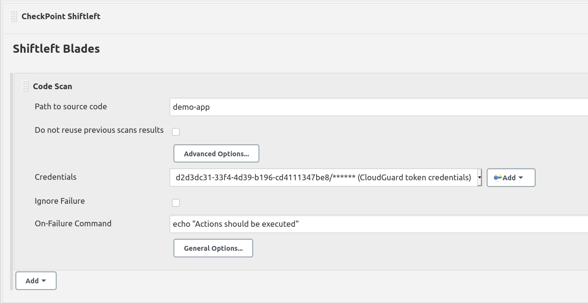
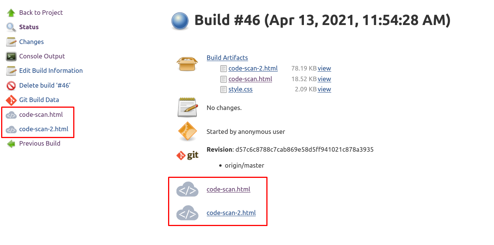

# cloudguard-shiftleft

[](https://app.soluble.cloud/repos/details/github.com/dasalebr/cloudguard-shiftleft-plugin?orgId=288883884012)  

[](https://ci.jenkins.io/job/Plugins/job/cloudguard-shiftleft-plugin/job/master/)
[](https://github.com/jenkinsci/cloudguard-shiftleft-plugin/graphs/contributors)
[](https://plugins.jenkins.io/cloudguard-shiftleft)
[](https://github.com/jenkinsci/cloudguard-shiftleft-plugin/releases/latest)
[](https://plugins.jenkins.io/cloudguard-shiftleft)

## Introduction

This Jenkins plugin provides a configurable build step to execute [Check
Point](https://www.checkpoint.com/) CloudGuard Shiftleft CLI.
[CloudGuard](https://secure.dome9.com/v2/) Shiftleft CLI scanning tool is
composed by three blades:

* _image-scan_: Scans container images for security risks and vulnerabilities
* _code-scan_: Source code security and visibility into the risk analysis of the project
* _iac-assessment_: scans Infrastructure-as-code templates (Terraform),
  enabling DevOps and security teams to identify insecure configurations

## Getting started

### Installing Shiftleft

This plugin will assume that you have already installed Shiftleft in your
Jenkins agent, whether it is based on a virtual machine or a container image.

Shiftleft CLI is distributed for Linux, Windows and MacOS, to download you can
either follow the steps in [CloudGuard](https://secure.dome9.com/v2/) web
interface:


Alternatively you can download it using a file transfering tool like `wget`:

```bash
# Supported platforms: amd64,386
PLATFORM="amd64"
# Supported Operating systems: linux,windows,darwin (for MAC)
OS="linux"
VERSION=0.0.29

wget "https://shiftleft-prod.s3.amazonaws.com/blades/shiftleft/bin/${OS}/${PLATFORM}/${VERSION}/shiftleft"
chmod +x shiftleft      # Make the file executable
mv shiftleft /usr/bin   # Move the executable to a directory within your PATH
```

### Generate CloudGuard credentials

You will need a CloudGuard account to abe able to use Shiftleft within your
Jenkins pipelines. [Register](https://secure.dome9.com/v2/register/invite) to
CloudGuard if you haven't already.

Once you have logged into your CloudGuard account, within the
Settings->Credentials menu, you can generate a new CloudGuard token.  Write
down the CloudGuard token secret, as you will not have access to it once you
close the pop-up window


Once you have this token, you will need to create a Username and Password
credential in your Jenkins server, that will be used by CloudGuard Shiftleft
plugin to authenticate against CloudGuard backend.



## Code Scanning

You can make use of code-scan blade to search for threats and vulnerabilities
in your Git repositories. Shiftleft will analyze the git repository, looking
for potential vulnerabilities that can be found in it. This includes:
- *Code analysis*: Check the code for weak coding practices, such as SQL
  injection, debug flags in our code, and cross site scripting (among others)
- *Content analysis*: Shiftleft will parse the repository files looking for
  exposed credentials or tokens that may have been left there by mistake.
- *Vulnerability scanning*: Check the package managers (like npm for javascript or ,
  pip for python) to find vulnerable dependencies.
- *Malware*: Using ThreatCloud API, to analyze files reputation within our git
  repository (even though it is not a good practice to include binaries within
  the source code)
- *IPs and URLs* found in the files, to also get a reputation score making use of
  ThreatCloud

Once you install CloudGuard Shiftleft plugin, you will be able to add a new
build step to your freestyle project. As an example, we have the following job
that checks out a Git repo to a specific directory:



Add a new build step and select _CheckPoint Shiftleft_



Select _code-scan_ blade


Fill in the mandatory fields, in this case the path where the repo has been
cloned and the credentials we previously created:



## Image Scanning

Shiftleft _image-scan_ blade scans container images checking for
vulnerabilities and threats. It includes all the checks previously described in
the _code-scan_ blade, and adds on top of that vulnerability scanning for OS
level packages, like `apk`, `dpkg` or `rpm`

## Shiftleft Results

Once CheckPoint Shiftleft build steps are executed in the job, the plugin will
generate a report for each blade invokation that will be archived as job
artifacts. When you navigate into the build view, links in the left navigation
pane as well as in the job results section will take you to the report details:




## Contributing

Refer to our [contribution guidelines](https://github.com/jenkinsci/.github/blob/master/CONTRIBUTING.md)

## LICENSE

Licensed under MIT, see [LICENSE](LICENSE.md)

